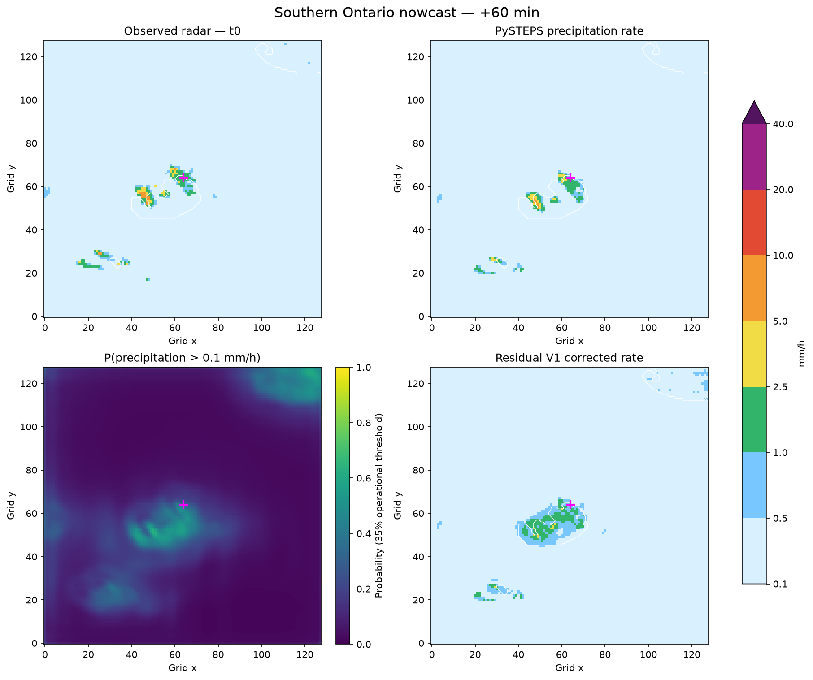

# Live Southern Ontario Nowcast Application

The live Streamlit application turns a place search into a 0–120 minute precipitation nowcast. A normal user selects a Southern Ontario location and presses **Generate 2-hour nowcast**; the service discovers and downloads recent NOAA MRMS observations, constructs an exact ten-frame history, runs the frozen operational model, and presents a location summary, time series, and surrounding map.



The screenshot uses the bundled non-FINAL DEV software fixture. It illustrates the product, not additional validation.

## Supported region

The explicit operational domain is the established Southern Ontario analysis region, WGS84 bounding box `[-84.8, 41.5, -75.5, 46.5]`, transformed to the existing EPSG:3978 grid. Locations outside it are rejected before radar download or inference.

Each request uses a 128 × 128, 2 km tile (approximately 256 km square). Near an edge the tile shifts inward while keeping the selected point inside; unknown geography is never padded as valid radar.

## Live data

The source is the anonymous NOAA MRMS public S3 archive, product `PrecipRate_00.00`. The application finds the latest available scan and requests the exact sequence `t−54, t−48, …, t−6, t0`. A missing scan retains its intended timestamp and becomes an invalid masked frame; no neighboring frame is duplicated. More than one missing frame, or less than 90% spatial coverage in an available tile, causes a temporary availability error.

The page always reports radar issue time and product age. Data older than 20 minutes produces a visible engineering freshness warning.

## Location workflow

1. Enter a city, address, or place such as Toronto, Waterloo, or Hamilton.
2. Confirm one of the resolved OpenStreetMap Nominatim results.
3. Press **Generate 2-hour nowcast**.
4. Read the headline rain-signal summary and next-30/60/120-minute values.
5. Inspect the selected-location series and surrounding map.
6. Press **Refresh latest radar** to check for a newer scan.

If geocoding is unavailable, manual latitude/longitude remains functional under **Advanced**. Locations are kept only in the Streamlit session and are not permanently stored or sent to analytics.

## Forecast outputs

Residual V1 rain probability and corrected precipitation rate are the primary products. The simple interpretation uses only the frozen `P ≥ 0.35` decision. Deterministic PySTEPS is available as a baseline comparison. The map supports observed radar (“Now”), Residual V1 rate, rain probability, operational mask, and PySTEPS for +6 through +120 minutes.

## Local launch

```powershell
uv sync --extra data --extra baseline --extra demo --extra operational
uv run streamlit run app/live_nowcast.py
```

Configuration environment variables:

- `NOWCAST_BUNDLE_DIR`: frozen bundle location;
- `NOWCAST_CACHE_DIR`: writable raw-data cache, default `artifacts/operational/live_cache`;
- `NOWCAST_DEVICE`: set to `cuda` only when supported;
- `NOWCAST_STALE_WARNING_MINUTES`: UI warning age, default `20`.

## Caching and concurrency

- Raw immutable MRMS files are keyed by NOAA source filename.
- Downloads use exclusive lock files, unique temporary files, size verification, and atomic replacement.
- Streamlit caches geocoding briefly and live results by location, refresh token, device, bundle version, and configuration hash.
- Forecast identity includes tile origin, issue timestamp, model version, and configuration hash.

Changing map lead or layer never reruns inference. Refresh is user-triggered and checks live availability rather than polling continuously.

## Container deployment

Build and run:

```powershell
docker build -t ontario-nowcast-v1 .
docker run --rm -p 8501:8501 --memory=4g ontario-nowcast-v1
```

Open `http://localhost:8501`. The container includes only application source and the frozen operational bundle—not TRAIN, DEV, FINAL, or raw research datasets. It requires outbound HTTPS access to NOAA S3 and Nominatim, plus a writable `/tmp/nowcast-cache`. The health check verifies that the bundle manifest exists and Streamlit’s lightweight health endpoint responds; it does not run inference.

Allow roughly 4 GB RAM and 2 GB container/runtime disk headroom. An uncached CPU request is expected to take tens of seconds; the measured development benchmark was about 16 seconds per tile, dominated by PySTEPS, excluding live download/decode time.

## Testing

Normal tests mock listings, downloads, and decoding and do not require current network availability:

```powershell
uv run pytest
```

The explicit engineering-only network integration test is:

```powershell
uv run python tests/live_mrms_smoke.py
```

It downloads current data and runs one forecast. It is not a scientific evaluation and is not part of the standard suite.

## Troubleshooting

- **No matching place:** use manual coordinates.
- **Outside domain:** select a point inside the displayed Southern Ontario bounds.
- **Too many missing scans / insufficient coverage:** wait for the NOAA feed and refresh.
- **Radar delayed:** the output remains timestamped; treat it as stale.
- **Hash mismatch:** restore the byte-identical operational bundle. The application will not silently load changed artifacts.
- **Slow first request:** live downloads, GRIB decoding, PySTEPS, and model load are uncached initially.

## Limitations and safety

This is an experimental short-range precipitation nowcast validated on selected Southern Ontario weather events. It is not an official weather warning service. Forecast range is 0–2 hours; radar-blind storm initiation remains difficult; probabilities are not perfectly calibrated; PySTEPS is an essential input. Use official Environment and Climate Change Canada warnings for safety-critical decisions.

Live operation does not constitute additional scientific validation of V1. No training, recalibration, threshold change, or new scientific claim is introduced by this application.
